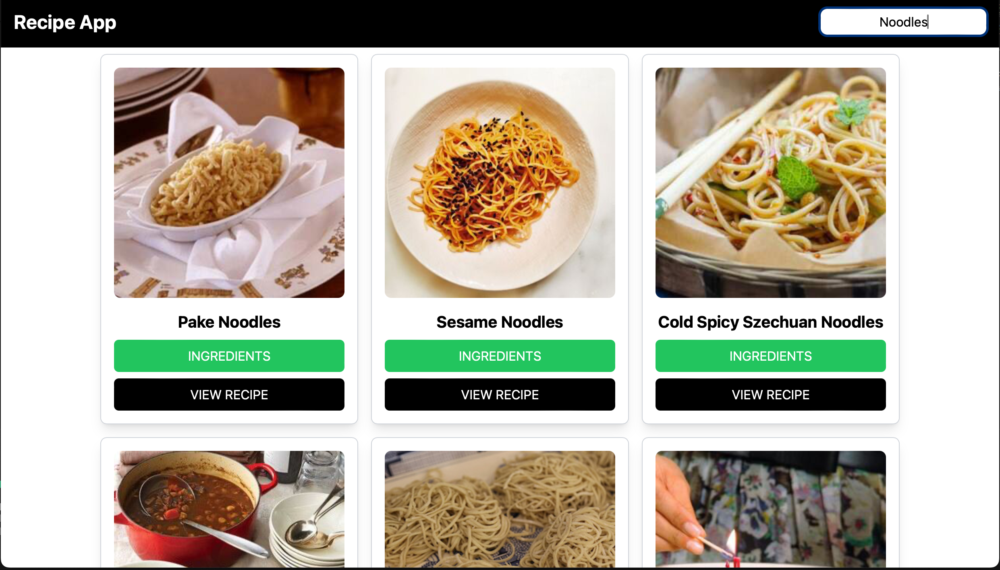

# Recipe Finder 

A recipe fidner application which lets you find recipes of your choice to make and enjoy.


## Tech Stack

**Client:** React, Tailwind-CSS, Axios

**API:** EDAMAM


## Screenshots




## API Reference

#### Link to fetch the API Data

```http
  `https://api.edamam.com/search?q='fooditem'&app_id='your_api_id'&app_key='your_api_key'`
```

| Parameter | Type     | Description                |
| :-------- | :------- | :------------------------- |
| `api_key` | `string` | **Required**. Your API key |

| Parameter | Type     | Description                       |
| :-------- | :------- | :-------------------------------- |
| `api_id`      | `string` | **Required**. Your API ID |


## Run Locally

Clone the project

```bash
  git clone https://github.com/vverma022/Recipe-Finder-Application.git
```

Go to the project directory

```bash
  cd food-recipe-finder
```

Install dependencies

```bash
  npm install
```

Start the server

```bash
  npm run dev
```


## License

[MIT](https://choosealicense.com/licenses/mit/)

